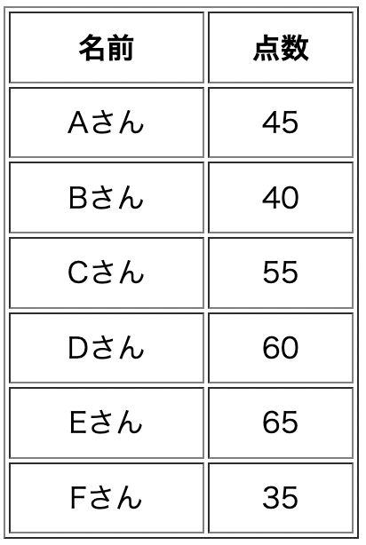
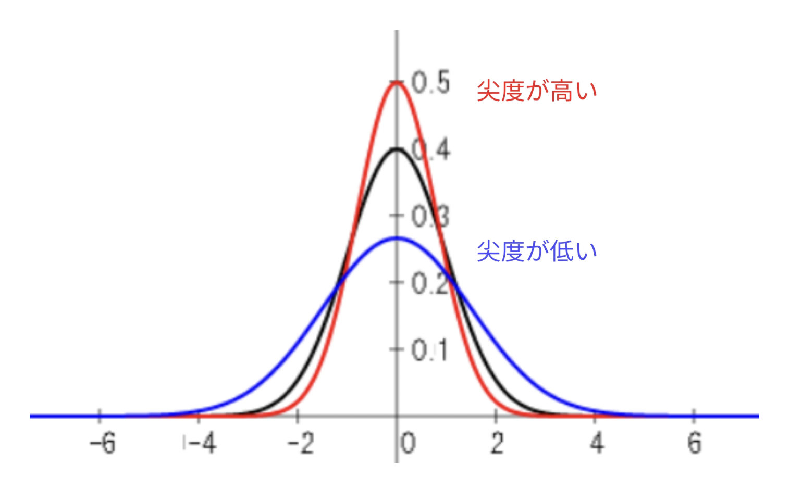
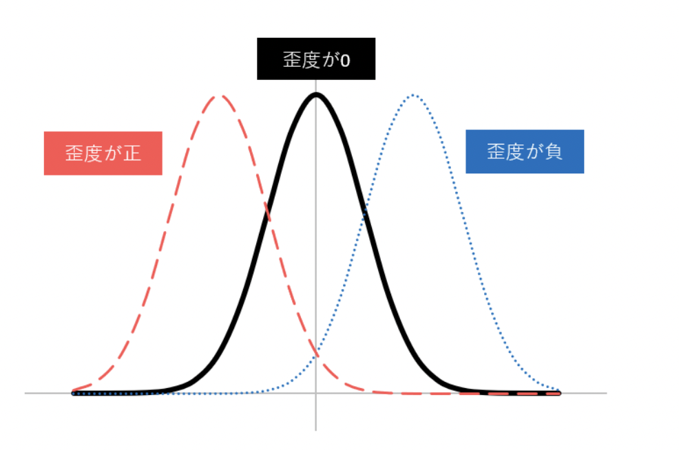
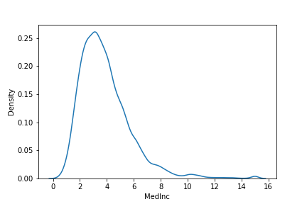
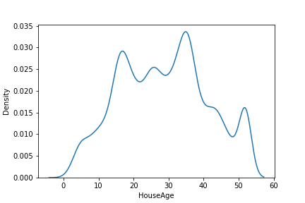
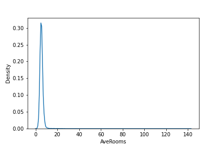
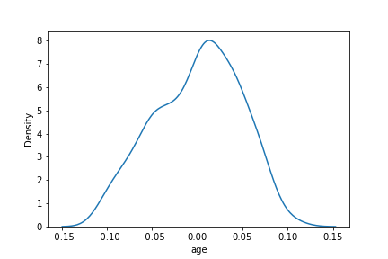
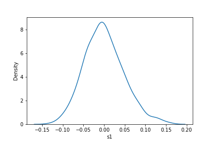
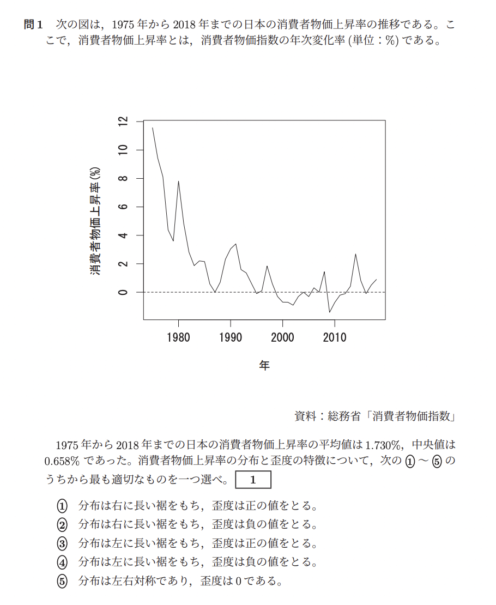

# 第2回　記述統計②

### 1.平均、偏差、平方和、分散、標準偏差
第1回の講座で学習した四分位数などと同様に、平均、偏差、平方和、分散、標準偏差も記述統計量の一部です。

<b>平均：全てのデータを足した値をデータ数で割った値</b>
$$
\bar x = \frac{x_{1} + x_{2} + ... + x_{n}}{n}
$$

<b>偏差：個々のデータと平均値との差</b>
データのバラつきを表すが、正の値と負の値が存在する。
$$
偏差 = x_{i} - \bar x \qquad(i = 1, 2,..., n)
$$

<b>平方和：それぞれの偏差を2乗した値の和</b>
正の値のみでバラつきを表せるが、データ数が増えると値が大きくなる。
$$
\begin{align}
S &= (x_{1} - \bar x)^{2} + (x_{2} - \bar x)^{2} + ... + (x_{n} - \bar x)^{2}\\
&= \sum_{i=1}^{N} (x_{i} - \bar x)^{2}\\
&= \sum_{i=1}^{N} x_{i}^{2} - \frac{\biggl(\displaystyle\sum_{i=1}^{N}x_{i}\biggr)^{2}}{n}\\
&= データの2乗の合計 - \frac{データの合計の2乗}{データ数}
\end{align}
$$

証明
https://qcplanets.com/method/statistics/squares/

<b>分散：平方和をデータ数で割った値</b>
データ数に依存せずにバラつきを表せるが、平均値と次元が異なる。
$$
V = \frac{S}{n}
$$

<b>標準偏差：分散の正の平方根の値</b>
平均値と同じ次元でバラつきを表せる。
$$
\sigma = \sqrt{V}
$$

#### ■ 問1　電卓を使って記述統計量の算出

■ 解答
1.平均値：50
$$
\begin{align}
\bar x &= \frac{45 + 40 + 55 + 60 + 65 + 35}{6}\\
&= 50
\end{align}
$$

2.偏差の和：0
$$
(45 - 50) + (40 - 50) + (55 - 50) + 
(60 - 50) + (65 - 50) + (35 - 50) = 0
$$

3.平方和：700
$$
\begin{align}
S &= \sum_{i=1}^{N} (x_{i} - \bar x)^{2}\\
&= (45 - 50)^{2} + (40 - 50)^{2} + (55 - 50)^{2} + 
(60 - 50)^{2} + (65 - 50)^{2} + (35 - 50)^{2}\\
&= 25 + 100 + 25 + 100 + 225 + 225\\
&= 700
\end{align}
$$
別解
$$
\begin{align}
S &= \sum_{i=1}^{N} x_{i}^{2} - \frac{\biggl(\displaystyle\sum_{i=1}^{N}x_{i}\biggr)^{2}}{n}\\
&= (45^{2} + 40^{2} + 55^{2} + 60^{2} + 65^{2} + 35^{2}) - \frac{(45 + 40 + 55 + 60 + 65 + 35)^2}{6}\\
&= 700
\end{align}
$$

4.分散：116.6
$$
\begin{align}
V &= \frac{S}{n}\\
&= \frac{700}{6}\\
&= 116.6
\end{align}
$$

5.標準偏差：10.8
$$
\begin{align}
\sigma &= \sqrt{V}\\
&= \sqrt{116.6}\\
&= 10.8
\end{align}
$$

#### ■ 問2　Pythonを使って記述統計量の算出

Notebook参照

### 2.変動係数
変動係数も記述統計量の一部です。

<b>変動係数：標準偏差を平均値で割った値（無次元）</b>
$$
CV = \frac{\sigma}{\bar x}
$$

#### ■ 問3　電卓を使って変動係数の算出

A組の変動係数
$$
CV_{A} = \frac{\sigma_{A}}{\bar x_{A}} = \frac{10}{40} = 0.25
$$

B組の変動係数
$$
CV_{B} = \frac{\sigma_{B}}{\bar x_{B}} = \frac{20}{90} = 0.22
$$

よって、A組のバラつきの方が大きい。

#### ■ 問4　Pythonを使って変動係数の算出

Notebook参照

### 3.尖度と歪度
データの分布をグラフに著したとき、平均値や分散などは分布の中心位置と広がり具合を表す統計量です。
その他にも非対称性や分布のとがり具合を表す統計量があります。

<b>尖度：分布のとがり具合を表す</b>
正規分布を3とし、3より大きければ正規分布より裾が長く、中央部がとがった分布になる。
逆に3より小さければ正規分布より裾が短く、中央部が丸まった分布になる。
※計算値から3を引いて、正規分布を0する場合もある。

$$
尖度 = \frac{\displaystyle\sum_{i=1}^{n} (x_{i} - \bar x)^{4}}{n\sigma^{4}}
$$

画像出典：https://best-biostatistics.com/summary/waido-sendo.html

<b>歪度：分布の非対称性を表す</b>
分布の左側に山があるときに正、分布の右側に山があるときに負の値をとる。
左右対称の場合、0になる。

$$
尖度 = \frac{\displaystyle\sum_{i=1}^{n} (x_{i} - \bar x)^{3}}{n\sigma^{3}}
$$

画像出典：https://www.ssk-com.co.jp/analysis/2382/%E6%AD%AA%E5%BA%A6%E3%83%BB%E5%B0%96%E5%BA%A6%E3%81%A8%E6%AD%A3%E8%A6%8F%E5%88%86%E5%B8%83/

#### ■ 問5　尖度と歪度

1.2.
3.4.
5.

1.尖度が最も大きいグラフ: 3
2.歪度が最も大きいグラフ: 3

実際の計算値はNotebook参照

#### 過去問に挑戦
2021年6月　統計検定2級過去問より抜粋
