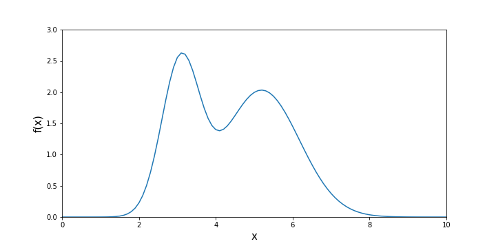
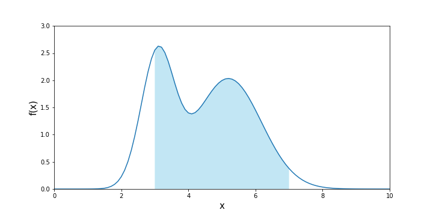
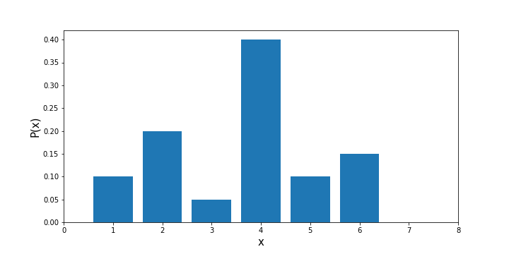
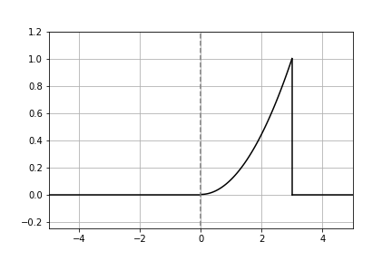
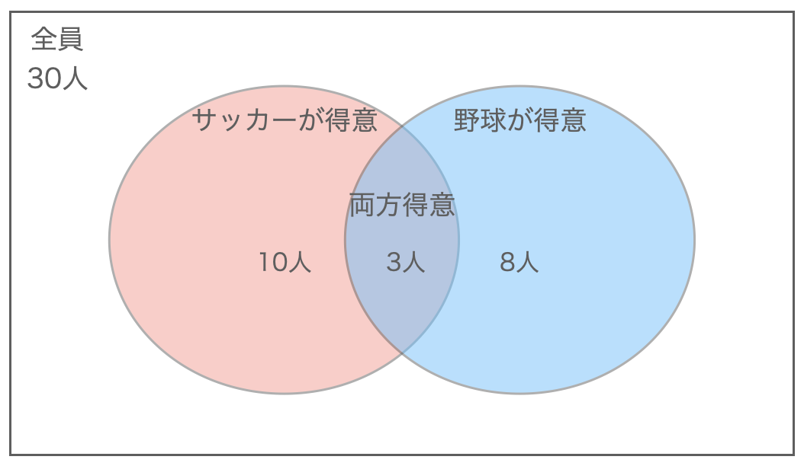
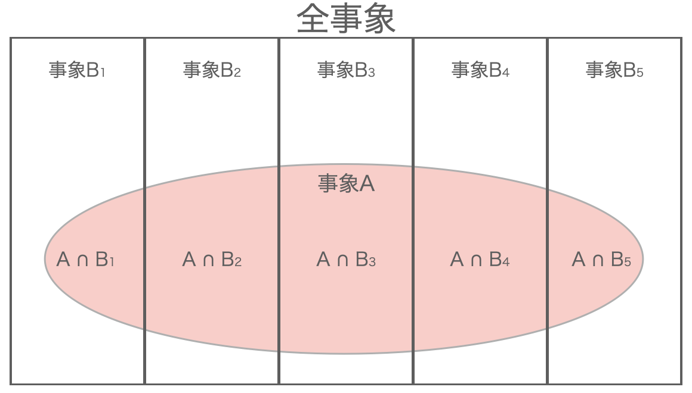

# 第6回　確率①

<b>事象</b>
ある試行のもとで起こる事柄。

<b>独立試行（独立）</b>
ある事象がその他の事象に影響を与えない試行のこと。

独立試行の例：
コイン投げの場合
くじ引きをして、引いたくじを戻す場合

独立でない例：
くじ引きをして、引いたくじを戻さない場合

<b>確率</b>
ある事象が起こる確らしさを数値で表したもの。
$p$、$P$、$Pr\{\}$などで表すことが多い。
確率は必ず以下の式を満たす。
$$0\leq Pr\{A\} \leq 1$$
また、ある事象の全ての場合の確率を足すと、必ず1になる。

<b>確率変数</b>
どのような値を取るか確率的に変化する変数。
連続型と離散型がある。

<b>確率分布</b>
確率変数がとる値と、その時の確率の対応を図に表したもの。

<b>連続型確率変数</b>
重さや温度などのように、連続した値をとる確率変数。
例えば重さの場合、10gと11gの間には10.1g、10.01g、10.001gなどの無数の値が存在する。

<b>連続分布</b>
連続型確率変数の確率分布。
縦軸は確率ではなく、確率密度を表す。

<b>確率密度関数</b>
連続分布の縦軸の値を表す関数。
$-\infty$から$\infty$の範囲の確率密度関数をグラフに表すと連続分布になる。
確率密度関数をある範囲で積分すると、その範囲の確率が表される。
すべての範囲で積分すると1になる。
$$\int_{-\infty}^{\infty}f(x)dx = 1$$

$$P = \int_{3}^{7}f(x)dx$$

<b>離散型確率変数</b>
コインの裏表やサイコロの出る目のように、飛び飛びの値をとる確率変数。
例えば立方体の一般的なサイコロの目の場合、1、2、3、4、5、6の値しかなく、1.5や2.1などの値は存在しない。

<b>離散分布</b>
離散型確率変数の確率分布。
縦軸は確率を表す。
全ての確率の和は1になる。
$$P(X_{1}) + P(X_{2}) + ... + P(X_{n}) = 1$$

<b>確率変数の期待値</b>
確率変数がとる値と、その値をとる確率の積を全て足し合わせたもの。
確率変数がとる値を、確率によって重み付けした平均値。
Expectation、またはExpected valueの頭文字を取って$E(x)$で表されることが多い。

離散型確率変数の場合
$$E(x) = \sum_{i=1}^{n} x_{i}p_{i}$$

連続型確率変数の場合
$$E(x) = \int_{-\infty}^{\infty} xf(x)dx$$

<b>確率変数の分散</b>
確率変数がとる値と期待値の差の2乗と、確率の積を全て足し合わせたもの。
Varianceの頭文字を取って$V(x)$で表されることが多い。

離散型確率変数の場合
$$V(x) = \sum_{i=1}^{n} (x_{i} - E(x))^{2}p_{i} = E[(x-E(x))^{2}]$$

連続型確率変数の場合
$$V(x) = \int_{-\infty}^{\infty} (x - E(x))^{2}f(x)dx = E[(x-E(x))^{2}]$$

<b>確率変数の標準偏差</b>
$$D(x) = \sqrt{V(x)}$$

<b>期待値の性質</b>
①$E(C) = C (Cは定数)$
定数の期待値は定数

②$E(x + y) = E(x) + E(y)$
和の期待値は期待値の和

③$E(ax + b) = aE(x) + b$
定数倍の期待値は期待値の定数倍
定数項はそのまま

<b>分散の性質</b>
①$V(x) = E(x^{2}) - \{E(x)\}^{2}$
二乗の期待値 - 期待値の二乗

証明：
$E(x)=\mu$とおくと、
$$
\begin{align}
V(x) &= E[(x-E(x))^{2}]\\
&= E(x-\mu)^{2}\\
&= E(x^{2} - 2x\mu + \mu^{2})\\
&= E(x^{2}) - 2\mu E(x) + E(\mu^{2})\\
&= E(x^{2}) - 2\mu^{2} + \mu^{2}\\
&= E(x^{2}) - \mu^{2}\\
&= E(x^{2}) - \{E(x)\}^{2}
\end{align}
$$

②$V(C) = 0 (Cは定数)$
定数の分散は0

③$V(ax + b) = a^{2}V(x)$
分散の定数倍は2乗して外に出す
定数項は0

#### ■ 問1　離散型確率変数

■ 解答
1.サイコロの出る目の期待値：3.5
$$
\begin{align}
E(x_{1}) &= \frac{1}{6} \times 1 + \frac{1}{6} \times 2 + \frac{1}{6} \times 3 + \frac{1}{6} \times 4 + \frac{1}{6} \times 5 + \frac{1}{6} \times 6\\
\,\\
&= 3.5
\end{align}
$$

2.賞金金額の期待値：683
$$
\begin{align}
E(x_{2}) &= \frac{1}{6} \times 100 + \frac{1}{6} \times 200 + \frac{1}{6} \times 300 + \frac{1}{6} \times 500 + \frac{1}{6} \times 1000 + \frac{1}{6} \times 2000\\
\,\\
&= 683.33
\end{align}
$$

3.サイコロの出る目の分散：2.9
$$
\begin{align}
E(x_{1}^{2}) &= \frac{1}{6} \times 1^{2} + \frac{1}{6} \times 2^{2} + \frac{1}{6} \times 3^{2} + \frac{1}{6} \times 4^{2} + \frac{1}{6} \times 5^{2} + \frac{1}{6} \times 6^{2}\\
\,\\
&= \frac{91}{6}\\
\,\\
V(x_{1}) &= E(x_{1}^{2}) - \{E(x_{1})\}^{2}\\
\,\\
&= \frac{91}{6} - 3.5^{2}\\
\,\\
&= 2.92
\end{align}
$$

#### ■ 問2　連続型確率変数

■ 解答
1.aの値：$\frac{1}{9}$
確率密度関数を全ての範囲で積分すると1になるので、
$$
\begin{align}
\int_{0}^{3}ax^{2}dx = 1\\
\left[\frac{a}{3}x^3\right]^{3}_{0} = 1\\
\frac{a}{3} \times 3^{3} = 1\\
a = \frac{1}{9}
\end{align}
$$

よって、$y=f(x)$は以下のようなグラフになる。

2.$x$の期待値：2.25
$$
\begin{align}
E(x) &= \int_{0}^{3}x \times \frac{1}{9}x^{2}dx\\
\,\\
&= \frac{1}{9}\left[\frac{1}{4}x^4\right]^{3}_{0}\\
\,\\
&= \frac{81}{36}\\
\,\\
&= 2.25
\end{align}
$$

3.$x$の分散：0.338
$$
\begin{align}
V(x) &= E(x^{2}) - \{E(x)\}^{2}\\
\,\\
&= \int_{0}^{3}x^{2} \times \frac{1}{9}x^{2}dx - (2.25)^{2}\\
\,\\
&= \frac{1}{9}\left[\frac{1}{5}x^5\right]^{3}_{0} - \Bigr(\frac{9}{4}\Bigl)^{2}\\
\,\\
&= \frac{243}{45} - \frac{81}{16}\\
\,\\
&= 0.3375
\end{align}
$$

#### ■ 問3　2つの確率変数の期待値と分散

<b>期待値の性質（続き）</b>
④$x$と$y$が独立であれば、$E(xy) = E(x)E(y)$
積の期待値は期待値の積

独立とは互いに関連していないこと。
$x$の値によって$y$の値も変わるときは独立ではない。

<b>分散の性質（続き）</b>
④$V(x + y) = V(x) + V(y) + 2Cov(x, y)$

<b>共分散</b>
2つの確率変数$x$と$y$の関連性を測る尺度。

$$
\begin{align}
Cov(x, y) &= E[(x - E(x))(y - E(y))]\\
&=E(xy) - E(x)E(y)
\end{align}
$$

積の期待値 - 期待値の積
$x$と$y$が互いに独立のとき、期待値の性質④より、$Cov(x, y)=0$

<b>相関係数</b>
2つの確率変数$x$と$y$の関連性を測る尺度。
-1〜1の値で表される。

$$
r = \frac{Cov(x, y)}{\sqrt{V(x)V(y)}}
$$

■ 解答
1.合計点の期待値：90
$$
\begin{align}
E(x + y) &= E(x) + E(y)\\
&= 50 + 40\\
&= 90
\end{align}
$$

2.共分散：100
$$
\begin{align}
Cov(x, y) &= E(xy) - E(x)E(y)\\
&= 2100 - 50 \times 40\\
&= 100
\end{align}
$$

3.合計点の分散：350
$$
\begin{align}
V(x + y) &= V(x) + V(y) + 2Cov(x, y)\\
&= 100 + 150 + 200\\
&= 450
\end{align}
$$

4.相関係数：0.82
$$
\begin{align}
r &= \frac{Cov(x, y)}{\sqrt{V(x)V(y)}}\\
&= \frac{100}{\sqrt{100 \times 150}}\\
&= 0.816
\end{align}
$$

#### ■ 問4　加法定理
<b>加法定理</b>
事象Aが起こる確率を$P(A)$、事象Bが起こる確率を$P(B)$とすると、以下の式が成り立つ。
これを加法定理と言う。
$$
P(A \cup B) = P(A) + P(B) - P(A \cap B)
$$
$P(A \cup B)$：事象Aまたは事象Bが起こる確率
$P(A \cap B)$：事象Aかつ事象Bが起こる確率

事象Aと事象Bが互いに排反（同時に起こらない）である場合、
$$
P(A \cup B) = P(A) + P(B)
$$
となる。

例：

事象A：サッカーが得意、事象B：野球が得意とすると、
サッカーが得意な人の確率$P(A)=\frac{10}{30}$、野球が得意な人の確率$P(B)=\frac{8}{30}$となる。
サッカーまたは野球の少なくともどちらか一方が得意な人の確率を考える場合、そのまま$P(A)+P(B)$とすると、サッカーも野球も両方得意な人が重複してしまう。
よって、サッカーまたは野球の少なくともどちらか一方が得意な人の確率は、
$$
\begin{align}
P(A \cup B) &= P(A) + P(B) - P(A \cap B)\\
&= \frac{10}{30}+\frac{8}{30}-\frac{3}{30}\\
&= \frac{1}{2}
\end{align}
$$

■ 解答
1.　2つとも2の倍数の目が出る確率：$\frac{1}{4}$

1つ目のサイコロの目が2の倍数である確率$P(A_{1})$は$\frac{1}{2}$
2つ目のサイコロの目が2の倍数である確率$P(A_{2})$は$\frac{1}{2}$
よって、2つとも2の倍数の目が出る確率は
$$
P(A) = P(A_{1}) \times P(A_{2}) = \frac{1}{4}
$$

2.　2つとも3の倍数の目が出る確率：$\frac{1}{9}$

1つ目のサイコロの目が3の倍数である確率$P(B_{1})$は$\frac{1}{3}$
2つ目のサイコロの目が3の倍数である確率$P(B_{2})$は$\frac{1}{3}$
よって、2つとも3の倍数の目が出る確率は
$$
P(B) = P(B_{1}) \times P(B_{2}) = \frac{1}{9}
$$

3.　2つとも2の倍数または3の倍数の目が出る確率：$\frac{4}{9}$

1つ目のサイコロの目が2の倍数かつ3の倍数（6の倍数）である確率$P(A_{1} \cap B_{1})$は$\frac{1}{6}$
2つ目のサイコロの目が2の倍数かつ3の倍数（6の倍数）である確率$P(A_{2} \cap B_{2})$は$\frac{1}{6}$
よって、加法定理より、
$$
\begin{align}
P(A \cup B) &= P(A_{1} \cup B_{1}) \times P(A_{2} \cup B_{2})\\
&= \{P(A_{1}) + P(B_{1}) - P(A_{1} \cap B_{1})\} \times \{P(A_{2}) + P(B_{2}) - P(A_{2} \cap B_{2})\}\\
&= \Bigr(\frac{1}{2} + \frac{1}{3} - \frac{1}{6}\Bigl) \times \Bigr(\frac{1}{2} + \frac{1}{3} - \frac{1}{6}\Bigl)\\
&= \frac{4}{9}
\end{align}
$$

#### ■ 問5　条件付き確率
<b>条件付き確率</b>
ある事象が起こるという条件のもとで、別のある事象が起こる確率。
事象Aが起こる条件のもとで、事象Bが起こる確率は$P(B|A)$で表され、以下の式が成り立つ。
$$
P(B|A) = \frac{P(A \cap B)}{P(A)}
$$

■ 解答
1.　$\frac{1}{13}$

カードの数は4種類×13枚で52枚。
そのうち、スペードのカードを引く確率は$\frac{1}{4}$
また、10以上のカードを引く確率は$\frac{16}{52}=\frac{4}{13}$
よって、求める確率は、
$$
\frac{1}{4} \times \frac{4}{13} = \frac{1}{13}
$$

2.　$\frac{4}{13}$

A : 引いたカードがスペードである場合
B : 引いたカードが10以上である場合
とすると、引いたカードがスペードである確率$P(A)$は、
$$
P(A) = \frac{1}{4}
$$
また、引いたカードがスペードで、かつ10以上である確率$P(A \cap B)$は問1.より、
$$
P(A \cap B) =  \frac{1}{13}
$$
よって、求める確率$P(B|A)$は、
$$
\begin{align}
P(B|A) &= \frac{P(A \cap B)}{P(A)}\\
&= \frac{\frac{1}{13}}{\frac{1}{4}}\\
&= \frac{4}{13}
\end{align}
$$

#### ■ 問6　乗法定理
<b>乗法定理</b>
条件付き確率$P(B|A)$は、以下の式で表される。
$$
P(B|A) = \frac{P(A \cap B)}{P(A)}
$$
これを式変形すると、以下の式が成り立つ。
これを乗法定理と言う。
$$
P(A \cap B) = P(A) \times P(B|A) = P(B) \times P(A|B)
$$

事象Aと事象Bが互いに独立である場合、
$$
P(A \cap B) = P(A) \times P(B)
$$
となる。

■ 解答
1.　$\frac{1}{16}$

1枚目に引いたカードを戻すので、1枚目に引いたカードの事象Aと2枚目に引いたカードの事象Bは独立である。
1枚目に引いたカードがスペードである確率$P(A)$は、
$$
P(A) = \frac{1}{4}
$$
2枚目に引いたカードがスペードである確率$P(B)$も、
$$
P(B) = \frac{1}{4}
$$
よって、乗法定理より求める確率は、
$$
\begin{align}
P(A \cap B) &=  P(A) \times P(B)\\
&= \frac{1}{4} \times \frac{1}{4}\\
&= \frac{1}{16}
\end{align}
$$

2.　$\frac{1}{17}$
1枚目に引いたカードを戻さないので、1枚目に引いたカードの事象Aと2枚目に引いたカードの事象Bは独立ではない。
1枚目に引いたカードがスペードである確率$P(A)$は、
$$
P(A) = \frac{1}{4}
$$
その上で、2枚目に引いたカードもスペードである確率$P(B|A)$は、カード51枚の中にスペードは12枚あるので、
$$
P(B|A) = \frac{12}{51} = \frac{4}{17}
$$
よって、乗法定理より求める確率は、
$$
\begin{align}
P(A \cap B) &=  P(A) \times P(B|A)\\
&= \frac{1}{4} \times \frac{4}{17}\\
&= \frac{1}{17}
\end{align}
$$

#### ■ 問7　ベイズの定理①
乗法定理より、以下の式が成り立つ。
$$
P(A \cap B) = P(A) \times P(B|A) = P(B) \times P(A|B)
$$
これを式変形して、以下の式が成り立つ。
これを<b>ベイズの定理</b>という。
$$
P(B|A) = \frac{P(A|B) \times P(B)}{P(A)}
$$

■ 解答
1.　$\frac{1}{5}$

A : 日本人である
B : 女子である
とすると、
$$
P(A) = \frac{20 + 5}{30 + 20} = \frac{1}{2}、P(B) = \frac{20}{50} = \frac{2}{5}、P(A|B) = \frac{5}{20} = \frac{1}{4}
$$
である。ベイズの定理より、求める確率$P(B|A)$は
$$
\begin{align}
P(B|A) &=  \frac{P(A|B) \times P(B)}{P(A)}\\
&= \frac{\frac{1}{4} \times \frac{2}{5}}{\frac{1}{2}}\\
&= \frac{1}{5}
\end{align}
$$

#### ■ 問8　ベイズの定理②
<b>全確率の定理</b>
全事象が排反の事象$B_{1},B_{2},...,B_{k}$から構成されているとき、任意の事象$A$に対して以下の式が成り立つ。
$$
\begin{align}
P(A) &= P(A \cap B_{1}) + P(A \cap B_{2}) + ... + P(A \cap B_{k})\\
&= P(B_{1})P(A|B_{1}) + P(B_{2})P(A|B_{2}) + ... + P(B_{k})P(A|B_{k})
\end{align}
$$

ベイズの定理と全確率の定理を合わせて、
$$
\begin{align}
P(B_{i}|A) &= \frac{P(B_{i})P(A|B_{i})}{P(A)}\\
&= \frac{P(B_{i})P(A|B_{i})}{P(B_{1})P(A|B_{1}) + P(B_{2})P(A|B_{2}) + ... + P(B_{k})P(A|B_{k})}\\
&= \frac{P(B_{i})P(A|B_{i})}{\sum_{j=1}^{k}P(B_{j})P(A|B_{j})}\\
\end{align}
$$

■ 解答
1.　$\frac{15}{47}$

$A$ : 赤玉を取り出す事象
$B_{1}$ : 袋1を選ぶ事象
$B_{2}$ : 袋2を選ぶ事象
$B_{3}$ : 袋3を選ぶ事象
とすると、
$$
P(A|B_{1}) = \frac{1}{2}、P(A|B_{2}) = \frac{2}{5}、P(A|B_{3}) = \frac{2}{3}\\
\,\\
P(B_{1}) = P(B_{2}) = P(B_{3}) = \frac{1}{3}
$$
である。ベイズの定理より、求める確率$P(B_{1}|A)$は
$$
\begin{align}
P(B_{1}|A) &= \frac{P(B_{1})P(A|B_{1})}{P(A)}\\
\,\\
&= \frac{P(B_{1})P(A|B_{1})}{\sum_{j=1}^{3}P(B_{j})P(A|B_{j})}\\
\,\\
&= \frac{P(B_{1})P(A|B_{1})}{P(B_{1})P(A|B_{1}) + P(B_{2})P(A|B_{2}) + P(B_{3})P(A|B_{3})}\\
\,\\
&= \frac{\frac{1}{3} \times \frac{1}{2}}{\frac{1}{3} \times \frac{1}{2} + \frac{1}{3} \times \frac{2}{5} + \frac{1}{3} \times \frac{2}{3}}\\
\,\\
&= \frac{15}{47}
\end{align}
$$

#### ■ 問9　ベイズの定理③(モンティ・ホール問題)

■ 解答
1.　$\frac{1}{3}$

3つのドアをドア1、ドア2、ドア3とする。
最初にどのドアを選んだとしても一般性は失われないので、最初にドア1を選んだとする。

$A_{1}$ : 司会者がドア1を選ぶ事象。
ただし、最初にドア1を選んだ場合、司会者がドア1を選ぶことはないので考えない。
$A_{2}$ : 司会者がドア2を選ぶ事象
$A_{3}$ : 司会者がドア3を選ぶ事象
$B_{1}$ : ドア1が当たりである事象
$B_{2}$ : ドア2が当たりである事象
$B_{3}$ : ドア3が当たりである事象
とすると、
$$
P(A_{2}|B_{1}) = P(A_{3}|B_{1}) = \frac{1}{2}\\
$$

(ドア1が当たりの時は、司会者がドア2を選ぶ確率もドア3を選ぶ確率も同じ)

$$
P(A_{2}|B_{2}) = 0、P(A_{3}|B_{2}) = 1\\
$$

(ドア2が当たりの時は、司会者がドア2を選ぶ確率は0、ドア3を選ぶ確率は1)

$$
P(A_{2}|B_{3}) = 1、P(A_{3}|B_{3}) = 0\\
$$

(ドア3が当たりの時は、司会者がドア2を選ぶ確率は1、ドア3を選ぶ確率は0)

ドアが当たりである確率はどれも同じなので、
$$
P(B_{1}) = P(B_{2}) = P(B_{3}) = \frac{1}{3}
$$
である。

ドアを選び直さない場合、ベイズの定理より求める確率は
司会者がドア2を選ぶ場合、
$$
\begin{align}
P(B_{1}|A_{2}) &= \frac{P(B_{1})P(A_{2}|B_{1})}{\sum_{j=1}^{3}P(B_{j})P(A_{2}|B_{j})}\\
\,\\
&= \frac{P(B_{1})P(A_{2}|B_{1})}{P(B_{1})P(A_{2}|B_{1}) + P(B_{2})P(A_{2}|B_{2}) + P(B_{3})P(A_{2}|B_{3})}\\
\,\\
&= \frac{\frac{1}{3} \times \frac{1}{2}}{\frac{1}{3} \times \frac{1}{2} + \frac{1}{3} \times 0 + \frac{1}{3} \times 1}\\
\,\\
&= \frac{1}{3}
\end{align}
$$

司会者がドア3を選ぶ場合、
$$
\begin{align}
P(B_{1}|A_{3}) &= \frac{P(B_{1})P(A_{3}|B_{1})}{\sum_{j=1}^{3}P(B_{j})P(A_{3}|B_{j})}\\
\,\\
&= \frac{P(B_{1})P(A_{3}|B_{1})}{P(B_{1})P(A_{3}|B_{1}) + P(B_{2})P(A_{3}|B_{2}) + P(B_{3})P(A_{3}|B_{3})}\\
\,\\
&= \frac{\frac{1}{3} \times \frac{1}{2}}{\frac{1}{3} \times \frac{1}{2} + \frac{1}{3} \times 1 + \frac{1}{3} \times 0}\\
\,\\
&= \frac{1}{3}
\end{align}
$$

したがって、司会者がドア2を選んでもドア3を選んでもドア1が当たりである確率は$\frac{1}{3}$である。
最初にドア1以外を選んでも同様の結果になるので、<u>答えは$\frac{1}{3}$</u>

2.　$\frac{2}{3}$

1.と同様に、最初にドア1を選んだとする。
ドアを選び直す場合、ベイズの定理より求める確率は
司会者がドア2を選ぶ場合、ドア3を選ぶことになるので
$$
\begin{align}
P(B_{3}|A_{2}) &= \frac{P(B_{3})P(A_{2}|B_{3})}{\sum_{j=1}^{3}P(B_{j})P(A_{2}|B_{j})}\\
\,\\
&= \frac{P(B_{3})P(A_{2}|B_{3})}{P(B_{1})P(A_{2}|B_{1}) + P(B_{2})P(A_{2}|B_{2}) + P(B_{3})P(A_{2}|B_{3})}\\
\,\\
&= \frac{\frac{1}{3} \times 1}{\frac{1}{3} \times \frac{1}{2} + \frac{1}{3} \times 0 + \frac{1}{3} \times 1}\\
\,\\
&= \frac{2}{3}
\end{align}
$$

司会者がドア3を選ぶ場合、ドア2を選ぶことになるので
$$
\begin{align}
P(B_{2}|A_{3}) &= \frac{P(B_{2})P(A_{3}|B_{2})}{\sum_{j=1}^{3}P(B_{j})P(A_{3}|B_{j})}\\
\,\\
&= \frac{P(B_{2})P(A_{3}|B_{2})}{P(B_{1})P(A_{3}|B_{1}) + P(B_{2})P(A_{3}|B_{2}) + P(B_{3})P(A_{3}|B_{3})}\\
\,\\
&= \frac{\frac{1}{3} \times 1}{\frac{1}{3} \times \frac{1}{2} + \frac{1}{3} \times 1 + \frac{1}{3} \times 0}\\
\,\\
&= \frac{2}{3}
\end{align}
$$

したがって、司会者がドア2を選んでもドア3を選んでも選び直したドアが当たりである確率は$\frac{2}{3}$である。
最初にドア1以外を選んでも同様の結果になるので、<u>答えは$\frac{2}{3}$</u>

※
感覚的には、ドアを選び直さない場合、最初に当たりのドアを選ぶと当たり。
ドアを選び直す場合、最初にハズレのドアを選ぶと当たり。