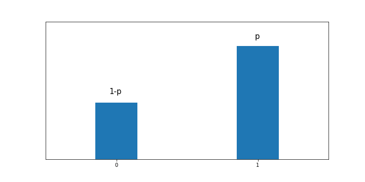
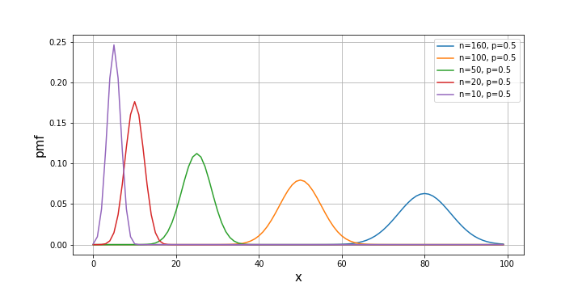
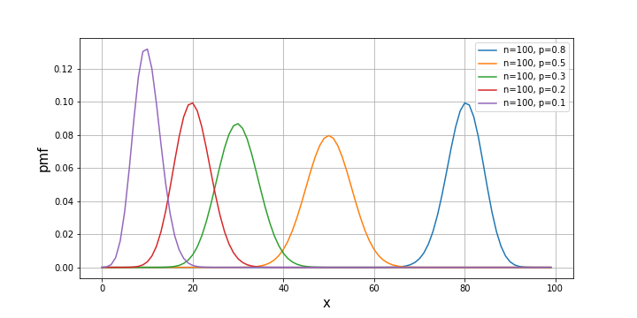
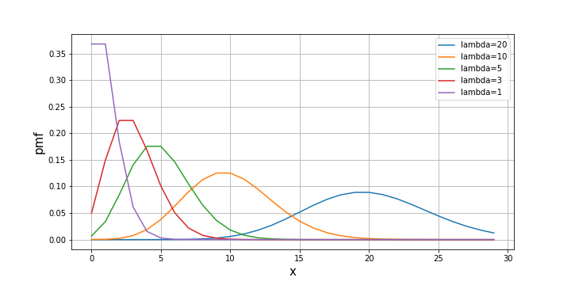
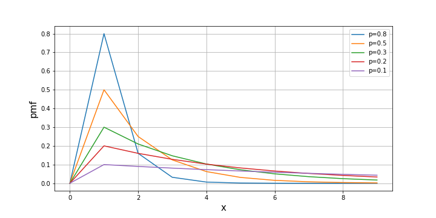
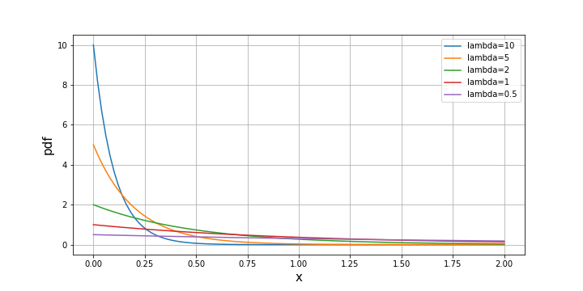
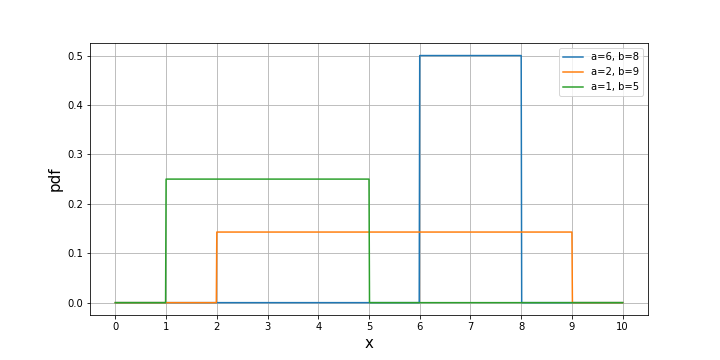
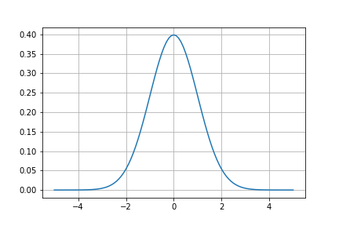
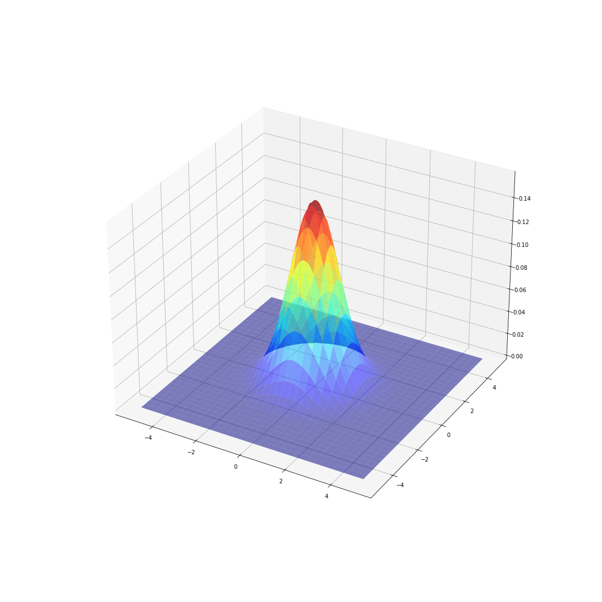

# 第7回　確率②

#### ■ 問1　二項分布
<b>ベルヌーイ試行</b>
2種類の結果しか得られない試行で、各試行は互いに独立で、確率は常に一定の試行をベルヌーイ試行という。
例
コインの裏表、勝負の勝ち負け、くじ引きの当たり外れ

<b>ベルヌーイ分布</b>
ベルヌーイ試行を1回行い、結果を0と1で表した分布。
1である確率が$p$のとき、0である確率は$1-p$となる。

ベルヌーイ分布の期待値と分散
ベルヌーイ分布の期待値と分散は以下の式で表される。
$$
E(x) = p\\
\,\\
V(x) = p(1 - p)
$$

<b>二項分布</b>
ベルヌーイ試行を$n$回行って、成功する回数$x$が従う確率分布を二項分布という。
ベルヌーイ試行を行う回数を$n$、成功する確率を$p$とすると、成功する回数$x$は二項分布に従い、$B(n, p)$と表す。
また、$n$回のベルヌーイ試行で$r$回成功する確率$P(x=r)$は以下の式で与えられる。
$$
P(x=r) = {}_nC_{r}p^{r}(1-p)^{n-r}
$$
\
二項分布の期待値と分散
二項分布$B(n, p)$の期待値と分散は以下の式で表される。
$$
E(x) = np\\
\,\\
V(x) = np(1 - p)
$$

※ベルヌーイ分布の期待値が$p$で、それを$n$回行うので期待値は$np$
また、ベルヌーイ試行は互いに独立。
それぞれのベルヌーイ分布の分散が$p(1-p)$で、それを$n$回行うので分散は$np(1-p)$

分散の和
$V(x + y) = V(x) + V(y) + 2Cov(x, y)(=0)$

\
\
試行回数$n$を変化させた二項分布のグラフ

確率$p$を変化させた二項分布のグラフ

■ 解答
1.不良品の数が0個になる確率：0.17
この問題では、ネジの製造は不良品が発生するかしないかの2通りなので、ベルヌーイ試行と考えられる。
従って、ネジの不良品の個数は二項分布に従う。
100個中16個の不良品が発生するので、不良品が発生する確率$p$は
$$
p = \frac{16}{100} = \frac{4}{25} = 0.16
$$
よって、ネジを10個製造したとき、不良品の数が0個になる確率は
$$
\begin{align}
P(x=0) &= {}_{10}C_{0}p^{0}(1-p)^{10-0}\\
&= 1 \times 1 \times 0.84^{10}\\
&= 0.174
\end{align}
$$

2.不良品の数が1個になる確率：0.33
1と同様に考えて、ネジを10個製造したとき、不良品の数が1個になる確率は
$$
\begin{align}
P(x=1) &= {}_{10}C_{1}p^{1}(1-p)^{10-1}\\
&= \frac{10!}{(10-1)!1!} \times 0.16 \times 0.84^{9}\\
&= 0.333
\end{align}
$$

3.不良品の数が2個になる確率：0.29
1と同様に考えて、ネジを10個製造したとき、不良品の数が2個になる確率は
$$
\begin{align}
P(x=2) &= {}_{10}C_{2}p^{2}(1-p)^{10-2}\\
&= \frac{10!}{(10-2)!2!} \times 0.16^{2} \times 0.84^{8}\\
&= 0.285
\end{align}
$$

4.不良品の数の期待値：1.6
二項分布$B(n, p)$の期待値は以下の式で表される。
$$
E(x) = np
$$
よって、求める期待値は
$$
E(x) = 10 \times 0.16 = 1.6
$$

5.不良品の数の分散：1.3
二項分布$B(n, p)$の分散は以下の式で表される。
$$
V(x) = np(1 - p)
$$
よって、求める分散は
$$
V(x) = 10 \times 0.16 \times 0.84 = 1.34
$$

#### ■ 問2　ポアソン分布
<b>ポアソン分布</b>
二項分布$B(n, p)$において、$np=\lambda$として$\lambda$を一定に保って、$n$を十分大きく、$p$を十分に小さくした場合の二項分布をポアソン分布といい、$Po(\lambda)$で表す。

例
宝くじを1000枚購入したときの当たりの数
1年間に生まれる三つ子の人数

ある期間に平均$\lambda$回起こる事象が$r$回起こる確率$P(x=r)$は以下の式で与えられる。
$$
P(x=r) = \frac{\lambda^{r}e^{-\lambda}}{r!} \quad(eはネイピア数=2.718....)
$$

※
二項分布のままでも確率$P(x=r)$の計算はできるが、計算が大変なためポアソン分布を使う。
例
当たる確率0.001の宝くじを1000枚購入したとき、2枚当たる確率$(n=1000, p=0.001, r=2)$
二項分布で計算すると
$$
P(x=2) = {}_{1000}C_{2}\times 0.001^{2}(1-0.001)^{1000-2} = 0.1840
$$
ポアソン分布で計算すると
$$
P(x=2) = \frac{1^{2}e^{-1}}{2!} = 0.1839
$$

\
ポアソン分布の期待値と分散
ポアソン分布$Po(\lambda)$の期待値と分散は以下の式で表される。
$$
E(x) = \lambda\\
\,\\
V(x) = \lambda
$$

※二項分布の期待値、分散の式から、$np=\lambda$、$1-p=1$とすると、上記の式が得られる。

$\lambda$を変化させたポアソン分布のグラフ

■ 解答
1.2個のキズが入っている確率：0.22
ネジ1本の面積$n$が$1,000mm^{2}$、キズがある確率$p$が$0.003$のような、$n$が十分大きく、$p$が十分小さい場合の二項分布に従う確率変数はポアソン分布に従う。
この問題では$n$や$p$の記述はないが、ポアソン分布に従うと記載されている。
「平均◯◯個」などの記載があるときはポアソン分布が使えるのではないかと疑いましょう。

1本あたり平均3個($\lambda=3$)のキズが入るネジに、2個のキズが入る確率は
$$
P(x=2) = \frac{3^{2}e^{-3}}{2!} = 0.224
$$

2.キズの数が2個以下である確率：0.32
1と同様に考えて、ネジに1個のキズが入る確率と0個のキズが入る確率は
$$
P(x=1) = \frac{3^{1}e^{-3}}{1!} = 0.0747\\
\,\\
P(x=0) = \frac{3^{0}e^{-3}}{0!} = 0.0249
$$
よって、ネジのキズの数が2個以下である確率は
$$
\begin{align}
P(x\leq2) &= P(x=2) + P(x=1) + P(x=0)\\
&= 0.224 + 0.0747 + 0.0249
&= 0.3236
\end{align}
$$

3.ネジのキズの数の期待値：3
ポアソン分布$Po(\lambda)$の期待値は以下の式で表される。
$$
E(x) = \lambda
$$
よって、求める期待値は
$$
E(x) = 3
$$

4.ネジのキズの数の分散：3
ポアソン分布$Po(\lambda)$の分散は以下の式で表される。
$$
V(x) = \lambda
$$
よって、求める分散は
$$
V(x) = 3
$$

#### ■ 問3　幾何分布
<b>幾何分布</b>
成功確率$p$がである独立なベルヌーイ試行を繰り返し、初めて成功するまでの試行回数が従う確率分布を幾何分布といい、$Geo(p)$で表す。

例
コインを投げて、3回目に表が出る確率
サイコロを投げて、4回目に1が出る確率

二項分布はベルヌーイ試行を$n$回繰り返し、何回成功したかの回数や数を考える。
幾何分布はベルヌーイ試行を繰り返し、何回目で成功したかの期間や間隔を考える。

成功確率$p$の独立なベルヌーイ試行を繰り返し、$r$回目で成功する確率$P(x=r)$は以下の式で与えられる。
$$
P(x=r) = (1 - p)^{r-1}p
$$

※
失敗する確率は$1-p$。
$r-1$回目までは失敗して、$r$回目で成功するので$(1 - p)^{r-1}p$となる。

\
幾何分布の期待値と分散
幾何分布$Geo(p)$の期待値と分散は以下の式で表される。
$$
E(x) = \frac{1}{p}\\
\,\\
V(x) = \frac{1-p}{p^{2}}
$$

$p$を変化させた幾何分布のグラフ

■ 解答
1.3人目の顧客でこのネジが売れる確率：0.13
ネジが売れる確率$p$が$20\%=0.2$だから、3人目の顧客でこのネジが売れる確率は、
$$
P(x=3) = (1 - 0.2)^{3-1} \times 0.2 = 0.128
$$

2.3人目までにこのネジが売れる確率：0.49
1と同様に考えて、2人目の顧客でこのネジが売れる確率と1人目の顧客でこのネジが売れる確率は
$$
P(x=2) = (1 - 0.2)^{2-1} \times 0.2 = 0.16\\
\,\\
P(x=1) = (1 - 0.2)^{1-1} \times 0.2 = 0.2
$$
よって、3人目までにこのネジが売れる確率は
$$
\begin{align}
P(x\leq3) &= P(x=3) + P(x=2) + P(x=1)\\
&= 0.128 + 0.16 + 0.2\\
&= 0.488
\end{align}
$$

3.ネジが売れるまでの人数の期待値：5
幾何分布$Geo(p)$の期待値は以下の式で表される。
$$
E(x) = \frac{1}{p}
$$
よって、求める期待値は
$$
E(x) = \frac{1}{0.2} = 5
$$

4.ネジが売れるまでの人数の分散：20
幾何分布$Geo(p)$の分散は以下の式で表される。
$$
V(x) = \frac{1-p}{p^{2}}
$$
よって、求める分散は
$$
V(x) = \frac{1-0.2}{0.2^{2}} = 20
$$

#### ■ 問4　指数分布
<b>指数分布</b>
幾何分布$Geo(p)$はベルヌーイ試行を繰り返すので離散型確率分布となる。
これを連続型確率分布にしたものを指数分布と言い、$Exp(\lambda)$で表す。
指数分布はランダムなイベントの発生間隔などを表す。

例
コールセンターに電話がかかってくるまでの時間
機械が故障するまでの時間

※以下は離散型なので幾何分布
コインを投げて、3回目に表が出る確率（表が出るまでの期間）
サイコロを投げて、4回目に1が出る確率（1が出るまでの期間）

確率密度関数$f(x)$は以下の式で与えられる。(連続型なので確率密度関数$f(x)$で表す)
$$
f(x) = \left\{
\begin{array}{ll}
\lambda e^{-\lambda x}& (x \geq 0) \\
0 & (x \lt 0)
\end{array}
\right.
$$

\
指数分布の期待値と分散
指数分布$Exp(\lambda)$の期待値と分散は以下の式で表される。
$$
E(x) = \frac{1}{\lambda}\\
\,\\
V(x) = \frac{1}{\lambda^{2}}
$$

$\lambda$を変化させた指数分布のグラフ

連続型の確率は確率密度関数をある範囲で積分することで求められる（第6回講座）。
従って、期間$x$が$t$以下となる確率$P(x \leq t)$は以下の式で与えられる。
$$
P(x \leq t) = \int_{-\infty}^{t} f(x)dx = \int_{0}^{t}\lambda e^{-\lambda x}dx = 1 - e^{-\lambda t}
$$

■ 解答
1.エンジントラブルが2年以内に発生する確率：0.86
エンジントラブルが1年間に発生する回数は平均して1回なので、$\lambda = 1$。
よって、2年以内にエンジントラブルが発生する確率は
$$
P(x \leq 2) = \int_{0}^{2}\lambda e^{-\lambda x} = 1 - e^{-2} = 0.864
$$

2.エンジントラブルの発生回数の期待値：1
指数分布$Exp(\lambda)$の期待値は以下の式で表される。
$$
E(x) = \frac{1}{\lambda}
$$
よって、求める期待値は
$$
E(x) = \frac{1}{1} = 1
$$

3.エンジントラブルの発生回数の分散：1
指数分布$Exp(\lambda)$の分散は以下の式で表される。
$$
V(x) = \frac{1}{\lambda^{2}}
$$
よって、求める分散は
$$
V(x) = \frac{1}{1^{2}} = 1
$$

#### ■ 問5　一様分布
<b>一様分布</b>
すべての事象が起こる確率が等しい確率分布を一様分布といい、$U(a, b)$で表す($a$:最小値、$b$:最大値)。
離散型と連続型がある。

例
離散型：サイコロの出る目の数(最小値$a=1$、最大値$b=6$)
連続型：少数を含む0から1まで数からランダムに選んだ数(最小値$a=0$、最大値$b=1$)

離散型の場合、事象が$r$となる確率$P(x=r)$は以下の式で与えられる。
$$
P(x=r) = \frac{1}{b - a + 1} \quad(r=a, a+1, ..., b)
$$

一様分布のグラフ

期待値と分散
離散型一様分布$U(a, b)$の期待値と分散は以下の式で表される。
$$
E(x) = \frac{a + b}{2}\\
\,\\
V(x) = \frac{(b - a + 1)^{2} - 1}{12}
$$

連続型の場合、確率密度関数$f(x)$は以下の式で与えられる。
$$
f(x) = \left\{
\begin{array}{ll}
\frac{1}{b - a} & (a \leq x \leq b) \\
\,\\
0 & (x \lt a, x \gt b)
\end{array}
\right.
$$

連続型の確率は確率密度関数をある範囲で積分することで求められるので、事象$x$が$t$以下となる確率$P(x \leq t)$は以下の式で与えられる。
$$
P(x \leq t) = \int_{-\infty}^{t} f(x)dx = \int_{a}^{t}\frac{1}{b - a}dx = \frac{t - a}{b - a}
$$

期待値と分散
連続型一様分布$U(a, b)$の期待値と分散は以下の式で表される。
$$
E(x) = \frac{a + b}{2}\\
\,\\
V(x) = \frac{(b - a)^{2}}{12}
$$

■ 解答
1.生成される数字が0.2以上0.4以下である確率：0.1
生成される数字が0.2以上0.4以下である確率は
$$
P(0.2 \leq x \leq 0.4) = \int_{0.2}^{0.4}\frac{1}{2 - 0}dx = \frac{1}{2}(0.4 - 0.2) = 0.1
$$

2.生成される数字の期待値：1
連続一様分布$U(a, b)$の期待値は以下の式で表される。
$$
E(x) = \frac{a + b}{2}
$$
よって、求める期待値は
$$
E(x) = \frac{0 + 2}{2} = 1
$$

3.生成される数字の分散：$\frac{1}{3}$
連続一様分布$U(a, b)$の分散は以下の式で表される。
$$
V(x) = \frac{(b - a)^{2}}{12}
$$
よって、求める分散は
$$
V(x) = \frac{(2 - 0)^{2}}{12} = \frac{1}{3}
$$

#### ■ 問6　超幾何分布
<b>超幾何分布</b>
$A$が$k$個、$B$が$N-k$個で構成される(全部で$N$個)集団があり、この集団から$n$個取り出したとき、$A$の個数が従う確率分布を超幾何分布といい、$HyperGeo(N, k, n)$で表す。

例
10個中赤玉3個、白玉7個が入っている袋から玉を5個取り出す。
1個ずつ復元抽出(取り出した玉を袋に戻す)する場合、赤玉の数は二項分布$B(5, \frac{3}{10})$に従う。
非復元抽出(取り出した玉を袋に戻さない)または同時に5個取り出す場合、赤玉の数は超幾何分布$HyperGeo(10, 3, 5)$に従う。

取り出した$A$の個数が$r$個となる確率$P(x=r)$は以下の式で与えられる。
$$
P(x=r) = \frac{{}_kC_{r} \times {}_{N-k}C_{n-r}}{{}_NC_{n}}
$$

\
超幾何分布の期待値と分散
超幾何分布$HyperGeo(N, k, n)$の期待値と分散は以下の式で表される。
$$
E(x) = \frac{nk}{N}\\
\,\\
V(x) = \frac{nk(N-k)(N-n)}{N^{2}(N-1)}
$$

■ 解答
1.不良品の数が1個となる確率：$\frac{7}{15}$
不良品2個の中から1個、良品8個の中から2個取り出す確率を考えれば良いので、
$$
P(x = 1) = \frac{{}_2C_{1} \times {}_{8}C_{2}}{{}_{10}C_{3}} = \frac{2 \times 28}{120} = \frac{7}{15}
$$

2.不良品の数の期待値：$\frac{3}{5}$
超幾何分布$HyperGeo(N, k, n)$の期待値は以下の式で表される。
$$
E(x) = \frac{nk}{N}
$$
よって、求める期待値は
$$
E(x) = \frac{2 \times 3}{10} = \frac{3}{5}
$$

3.不良品の数の分散：$\frac{28}{75}$
超幾何分布$HyperGeo(N, k, n)$の分散は以下の式で表される。
$$
V(x) = \frac{nk(N-k)(N-n)}{N^{2}(N-1)}
$$
よって、求める分散は
$$
V(x) = \frac{3 \times 2 \times (10-2) \times (10-3)}{10^{2} \times (10-1)} = \frac{336}{900} = \frac{28}{75}
$$

#### ■ 問7　負の二項分布
<b>負の二項分布</b>
ベルヌーイ試行を繰り返し、$k$回成功するまでの失敗する回数$r$が従う確率分布を負の二項分布という。
成功する確率を$p$とすると、$k$回成功するまでの失敗する回数$r$は負の二項分布に従い、$NB(k, p)$と表す。

ベルヌーイ試行を行う回数$n$が固定されていて、成功する回数$r$を表すのが二項分布。
成功する回数$k$が固定されていて、失敗する回数$r$を表すのが負の二項分布。

成功確率を$p$とすると、$k$回成功するまでに$r$回失敗する確率$P(x=r)$は以下の式で与えられる。
$$
P(x=r) = {}_{k+r-1}C_{r}p^{k-1}(1-p)^{r} \times p = {}_{k+r-1}C_{r}p^{k}(1-p)^{r}
$$

\
負の二項分布の期待値と分散
負の二項分布$NB(k, p)$の期待値と分散は以下の式で表される。
$$
E(x) = \frac{k(1-p)}{p}\\
\,\\
V(x) = \frac{k(1-p)}{p^{2}}
$$

■ 解答
1.不良品の数が2個になる確率：0.17
この問題は、製造した製品が良品か不良品かの2通りなので、ベルヌーイ試行と考えられる。
従って、3個良品を製造するときの不良品の個数は負の二項分布に従う。
良品率は$75\%=\frac{3}{4}$なので、良品を3個製造するまでに不良品が2個発生する確率$p$は
$$
P(x = 2) = {}_{3+2-1}C_{2} \times \Bigl(\frac{3}{4}\Bigr)^{3} \times \Bigl(\frac{1}{4}\Bigr)^{2} = \frac{162}{1024} = \frac{81}{512}
$$

2.不良品の数の期待値：1
負の二項分布$BN(k, p)$の期待値は以下の式で表される。
$$
E(x) = \frac{k(1-p)}{p}
$$
よって、求める期待値は
$$
E(x) = \frac{3(1 - \frac{3}{4})}{\frac{3}{4}} = 1
$$

3.不良品の数の分散：$\frac{4}{3}$
負の二項分布$BN(k, p)$の分散は以下の式で表される。
$$
V(x) = \frac{k(1-p)}{p^{2}}
$$
よって、求める分散は
$$
V(x) = \frac{3(1 - \frac{3}{4})}{\bigl(\frac{3}{4}\bigr)^{2}} = \frac{4}{3}
$$

#### 各種分布のまとめ
<b>回数や数の分布（成功した回数など）</b>
<u>二項分布、ポアソン分布</u>
二項分布・・・ベルヌーイ試行を繰り返す
ポアソン分布・・・二項分布の特例（確率が低く、試行回数が多い）

<b>期間や間隔の分布（成功するまでの回数、発生するまでの時間など）</b>
<u>幾何分布、指数分布</u>
幾何分布・・・離散分布
指数分布・・・連続分布

二項分布は試行回数に対する成功回数
幾何分布は1回成功するまでの試行回数

<b>その他</b>
<u>一様分布、超幾何分布、負の二項分布</u>
一様分布・・・どの点でも確率（確率密度）は同じ
超幾何分布・・・同時に複数個取り出す確率の問題
負の二項分布・・・場合の数（確率）の問題

#### 2変量正規分布（多変量正規分布）
1変量の正規分布のグラフ、数式は以下の通り。

$$
f(x) = \frac{1}{\sqrt{2\pi\sigma^{2}}}exp\{-\frac{(x - \mu)^{2}}{2\sigma^{2}}\}
$$

2変量の正規分布のグラフ、数式は以下のようになる。

$$
f(\vec{x}) = \frac{1}{\sqrt{(2\pi)^{2}|\Sigma|}}exp\{-\frac{1}{2}{}^{t}(\vec{x} - \vec{\mu})\Sigma^{-1}(\vec{x} - \vec{\mu})\}
$$

ここで、
$$
\vec{x} = \left(
\begin{array}{}
x_{1} \\
x_{2} \\
\end{array}
\right), 
\vec{\mu} = \left(
\begin{array}{}
\mu_{1} \\
\mu_{2} \\
\end{array}
\right), 
\Sigma = \left(
\begin{array}{}
\sigma^{2}_{x1} & \sigma_{x1x2}\\
\sigma_{x1x2} & \sigma^{2}_{x2}\\
\end{array}
\right), 
|\Sigma| = \sigma^{2}_{x1}\sigma^{2}_{x2} - \sigma^{2}_{x1x2}
$$

\
n変量の正規分布の数式は以下のようになる。

$$
f(\vec{x}) = \frac{1}{\sqrt{(2\pi)^{n}|\Sigma|}}exp\{-\frac{1}{2}{}^{t}(\vec{x} - \vec{\mu})\Sigma^{-1}(\vec{x} - \vec{\mu})\}
$$
