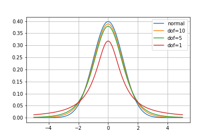
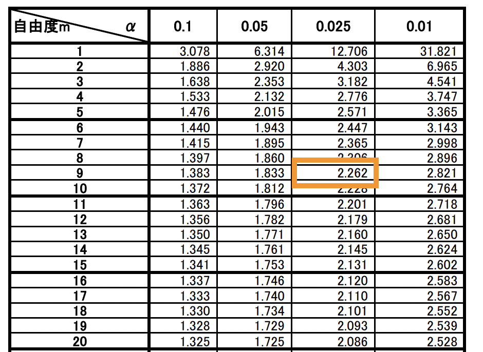
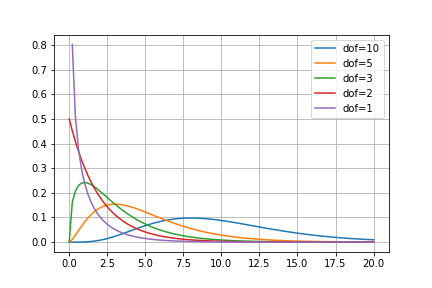
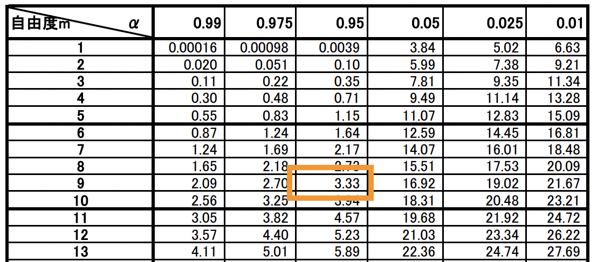
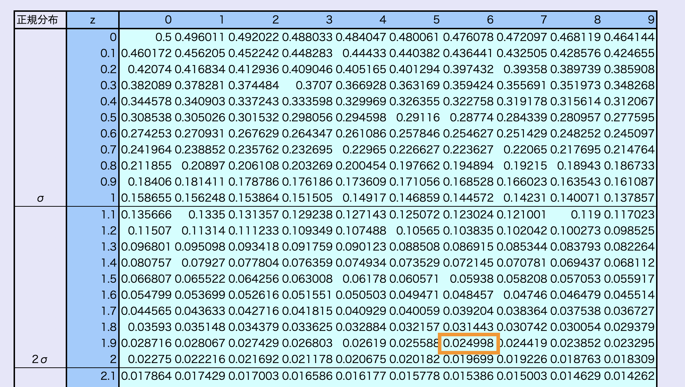
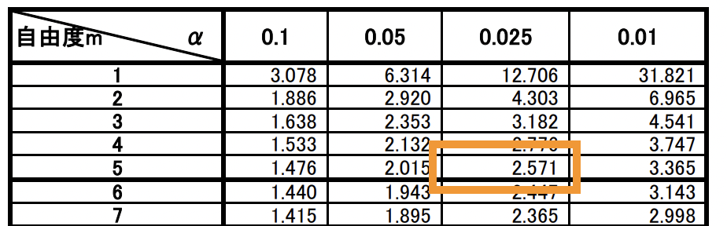
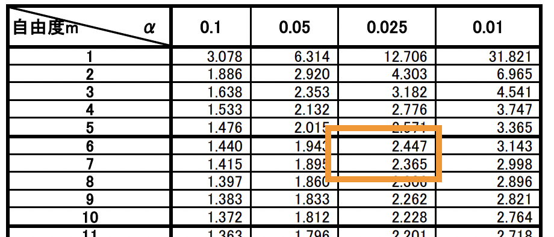
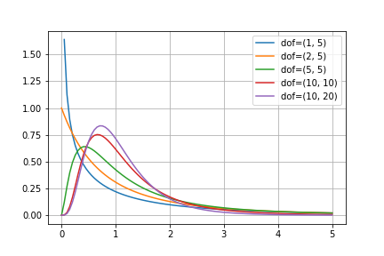
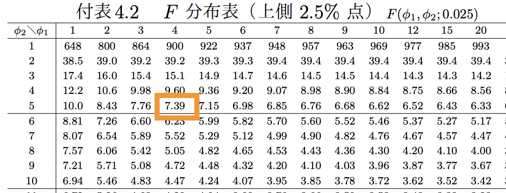

# 第9回　検定②

#### ■ 問1　母平均の検定（母分散未知）
<b>検定の流れ</b>
母集団が$N(\mu, \sigma^{2})$に従うとき、標本平均$
\bar{x}$は$N(\mu, \frac{\sigma^{2}}{n})$に従う。（第3回「標本平均の分布」）
よって、$u = \frac{\bar{x}-\mu}{\sqrt{\sigma^{2}/n}}$は$N(0, 1^{2})$に従う。（第3回「標本平均の標準化」）
ただし、この場合は母分散$\sigma^{2}$が不明なので、代わりに標本から算出した不偏分散$s^{2}$を使う。
このとき、$t = \frac{\bar{x}-\mu}{\sqrt{s^{2}/n}}$は自由度$n - 1$の$t$分布に従う。

t分布の特徴
・左右対称
・自由度が小さい（標本数が小さい）と裾野が広くなる
・自由度が十分大きい（標本数が非常に大きい）とき、標準正規分布と一致する。

①帰無仮説$H_{0}$と対立仮説$H_{1}$を設定する。
②有意水準$\alpha$を設定する。
③自由度と有意水準から、棄却域を確認する。
④統計検定量$t_{0}$の値を計算する。
⑤統計検定量$t_{0}$が棄却域に入っていれば「有意である」と判定し、帰無仮説$H_{0}$を棄却する。

■ 解答
1.
この問題では、$H_{0}:\mu = \mu_{0} =10.0$、$H_{1}:\mu \neq \mu_{0} = 10.0$である。
自由度$n-1=9$より、$t$分布表から棄却域は$|t_{0}| \geq 2.262$

次に、標本平均$\bar{x}$を求める。
$$
\begin{align}
\bar{x} &= \frac{10.3 + 10.5 + 9.8 + 10.2 + 10.4 + 10.8 + 10.7 + 10.7 + 9.7 + 9.9}{10}\\
&= 10.3
\end{align}
$$

次に、不偏分散$s^{2}$を求める。
$$
\begin{align}
s^{2} &= \frac{(10.3 - 10.3)^{2} + (10.5 - 10.3)^{2} + (9.8 - 10.3)^{2} + (10.2 - 10.3)^{2} + (10.4 - 10.3)^{2} + (10.8 - 10.3)^{2} + (10.7 - 10.3)^{2} + (10.7 - 10.3)^{2} + (9.7 - 10.3)^{2} + (9.9 - 10.3)^{2}}{10 - 1}\\
&= \frac{0^{2} + 0.2^{2} + (-0.5)^{2} + (-0.1)^{2} + 0.1^{2} + 0.5^{2} + 0.4^{2} + 0.4^{2} + (-0.6)^{2} + (-0.4)^{2}}{9}\\
&= 0.1556
\end{align}
$$

これらより、$t_{0}$を計算すると、
$$
t_{0} = \frac{\bar{x}-\mu_{0}}{\sqrt{s^{2}/n}} = \frac{10.3-10.0}{\sqrt{0.1556/10}} = 2.41
$$

となり、$|t_{0}| = 2.41\geq 2.262$となるので有意である。
よって、帰無仮説$H_{0}$は棄却される。
すなわち、設定通り($\mu_{0}=10.0$)に製造できていないと言える。

#### ■ 問2　Pythonを使って母平均の検定（母分散未知）

notebook参照

#### ■ 問3　母分散の検定
<b>検定の流れ</b>
母集団が$N(\mu, \sigma^{2})$に従うとき、その標本から得られる分散も何らかの分布を持つ。
ただし、分散はデータを2乗したものの和なので、正規分布のような分布には従わない。
このとき、$\chi^{2} = \frac{S}{\sigma^{2}} = \frac{(n-1)s^{2}}{\sigma^{2}}$は自由度$n - 1$の$\chi^{2}$分布に従う。

※$\chi^{2}$は標本を標準化したものの2乗の和
$$
\chi^{2} = \sum_{i=1}^{n} \Bigl(\frac{x_{i} - \bar{x}}{\sigma}\Bigr)^{2} = \frac{1}{\sigma^{2}} \sum_{i=1}^{n} (x_{i} - \bar{x})^{2} = \frac{S}{\sigma^{2}}
$$

$\chi^{2}$分布の特徴
・左右対称ではない
・自由度によって分布の形が大きく異なる

①帰無仮説$H_{0}$と対立仮説$H_{1}$を設定する。
②有意水準$\alpha$を設定する。
③自由度と有意水準から、棄却域を確認する。
④統計検定量$\chi^{2}_{0}$の値を計算する。
⑤統計検定量$\chi^{2}_{0}$が棄却域に入っていれば「有意である」と判定し、帰無仮説$H_{0}$を棄却する。

■ 解答
1.
この問題では、$H_{0}:\sigma = \sigma_{0}=1.5$、$H_{1}:\sigma < \sigma_{0} = 1.5$である。
自由度$n-1=9$より、$\chi^{2}$分布表から棄却域は$\chi^{2}_{0} \leq 3.33$

※$\chi^{2} = \frac{S}{\sigma^{2}}$、$\chi^{2}_{0} = \frac{S}{\sigma^{2}_{0}}$なので、$\sigma^{2}<\sigma^{2}_{0}$のとき、$\chi^{2}_{0} < \chi^{2}$となる。
よって、$\chi^{2}$分布の左側の棄却域に入るかどうかを検定する。

次に、平方和$S$を求める。
$$
\begin{align}
S &= (10^{2} + 9^{2} + 9^{2} + 9^{2} + 10^{2} + 10^{2} + 11^{2} + 9^{2} + 9^{2} + 9^{2}) - \frac{(10+9+9+9+10+10+11+9+9+9)^{2}}{10}\\
&= 907 - \frac{9025}{10}\\
&= 4.5
\end{align}
$$

これらより、$\chi^{2}_{0}$を計算すると、
$$
\chi^{2}_{0} = \frac{S}{\sigma^{2}_{0}} = \frac{4.5}{1.5} = 3.0
$$

となり、$\chi^{2}_{0} = 3.0 \leq 3.33$となるので有意である。
よって、帰無仮説$H_{0}$は棄却される。
すなわち、従来装置と比べてバラつきは変わった(小さくなった)と言える。

#### ■ 問4　Pythonを使って母分散の検定

notebook参照

#### ■ 問5　母比率の検定
<b>検定の流れ</b>
標本比率を$\hat{p}$、母比率を$p$とすると、中心極限定理より、サンプルサイズ$n$が十分に大きいとき、
$$
\hat{p}は近似的にN(p, \frac{p(1-p)}{n})に従う
$$
これを標準化すると、
$$
z = \frac{\hat{p}-p}{\sqrt{\frac{{p(1-p)}}{n}}}は近似的にN(0, 1^{2})
に従う。
$$

①帰無仮説$H_{0}$と対立仮説$H_{1}$を設定する。
②有意水準$\alpha$を設定する。
③棄却域を確認する。
④統計検定量$z_{0}$の値を計算する。
⑤統計検定量$z_{0}$が棄却域に入っていれば「有意である」と判定し、帰無仮説$H_{0}$を棄却する。

■ 解答
1.
この問題では、$H_{0}:p = p_{0} = 0.11$、$H_{1}:p \neq p_{0} = 0.11$である。
標準正規分布表から棄却域は$|z_{0}| \geq 1.96$

次に標本比率$\hat{p}$を求める。
$$
\hat{p} = \frac{20}{200} = 0.10
$$

これより、$z_{0}$を計算すると、
$$
z_{0} = \frac{\hat{p}-p_{0}}{\sqrt{\frac{{p_{0}(1-p_{0})}}{n}}} = \frac{0.10 - 0.11}{\sqrt{\frac{{0.11(1 - 0.11)}}{200}}} = -0.452
$$

となり、$|z_{0}| = 0.452 \leq 1.96$となるので有意ではない。
よって、帰無仮説$H_{0}$は棄却されない。
すなわち、従来装置と比べて不良品の発生率が変わったとは言えない。

#### ■ 問6　Pythonを使って母比率の検定

notebook参照

#### ■ 問7　母平均の差の検定（対応のあるデータ）
<b>検定の流れ</b>
データ$x_{1}$とデータ$x_{2}$が互いに独立にそれぞれ$N_{1}(\mu_{1}, \sigma^{2}_{1})$、$N_{2}(\mu_{2}, \sigma^{2}_{2})$に従うとき、
$x_{1} + x_{2}$は$N(\mu_{1} + \mu_{2}, \sigma^{2}_{1} + \sigma^{2}_{2})$に従う。（第3回「正規分布の再生性」）
ただし、互いに独立ではない場合、すなわちデータ$x_{1}$とデータ$x_{2}$に対応がある場合は独立性が成り立たない。
$$
x_{1} = a_{1} + \epsilon\\
x_{2} = a_{2} + \epsilon
$$
のように、対応を表す項$\epsilon$が付いている場合、この対応を表す項$\epsilon$を削除するように差をとって考えると良い。
2つの標本の差$x_{1}-x_{2}$を1つの標本と考え、母分散未知の場合の母平均の推定と同様に考える。
すなわち、2つの標本の差の平均を$\bar{x}_{d}$、2つの標本の差の不偏分散を$s^{2}_{d}$とすると、
$$
t_{0} = \frac{\bar{x}_{d} - (\mu_{1} - \mu_{2})}{\sqrt{\frac{s_{d}^{2}}{n}}}
$$
は自由度$n-1$の$t$分布に従う。

①帰無仮説$H_{0}$と対立仮説$H_{1}$を設定する。
②有意水準$\alpha$を設定する。
③自由度と有意水準から、棄却域を確認する。
④統計検定量$t_{0}$の値を計算する。
⑤統計検定量$t_{0}$が棄却域に入っていれば「有意である」と判定し、帰無仮説$H_{0}$を棄却する。

■ 解答
1.
前期の母平均を$\mu_{1}$、後期の母平均を$\mu_{2}$とすると、
この問題では、$H_{0}:\mu_{1}=\mu_{2}$、$H_{1}:\mu_{1} \neq \mu_{2}$である。
自由度$n-1 = 5$より、$t$分布表から棄却域は$|t_{0}| \geq 2.571$

次に前期と後期の点数の差の平均$\bar{x}_{d}$を求める。
$$
\begin{align}
\bar{x}_{d} &= \frac{(8.0 - 7.0) + (5.4 - 5.0) + (4.8 - 3.6) + (5.8 - 7.0) + (6.4 - 7.0) + (5.8 - 5.4)}{6}\\
\,\\
&= 0.2
\end{align}
$$

次に前期と後期の点数の差の不偏分散$s^{2}_{d}$を求める。
$$
\begin{align}
s^{2}_{d} &= \frac{(1.0 - 0.2)^{2} + (0.4 - 0.2)^{2} + (1.2 - 0.2)^{2} + (-1.2 - 0.2)^{2} + (-0.6 - 0.2)^{2} + (0.4 - 0.2)^{2}}{6 - 1}\\
\,\\
&= \frac{(0.8)^{2} + (0.2)^{2} + (1.0)^{2} + (-1.4)^{2} + (-0.8)^{2} + (0.2)^{2}}{5}\\
\,\\
&= 0.864
\end{align}
$$

これらより、$t_{0}$を計算すると、
$$
t_{0} = \frac{\bar{x}_{d} - (\mu_{1} - \mu_{2})}{\sqrt{\frac{s^{2}_{d}}{n}}} = \frac{0.2}{\sqrt{\frac{0.864}{6}}} = 0.527
$$

となり、$|t_{0}| = 0.527 \leq 2.571$となるので有意ではない。
よって、帰無仮説$H_{0}$は棄却されない。
すなわち、前期と後期の母平均は等しくないとは言えない。

#### ■ 問8　Pythonを使って母平均の差の検定（対応のあるデータ）

notebook参照

#### ■ 問9　母平均の差の検定（対応のないデータ、分散既知）
<b>検定の流れ</b>
データ$x_{1}$とデータ$x_{2}$が互いに独立にそれぞれ$N_{1}(\mu_{1}, \sigma^{2}_{1})$、$N_{2}(\mu_{2}, \sigma^{2}_{2})$に従うとき、
$x_{1} + x_{2}$は$N(\mu_{1} + \mu_{2}, \sigma^{2}_{1} + \sigma^{2}_{2})$に従う。（第3回「正規分布の再生性」）
また、データ$x$が互いに独立に$N(\mu, \sigma^{2})$に従うとき、$\bar{x}$は$N(\mu, \sigma^{2}/n)$に従う。（第3回「統計量の分布」）
すなわち、データ$\bar{x}_{1}$とデータ$\bar{x}_{2}$の差をとった$\bar{x}_{1} - \bar{x}_{2}$は$N(\mu_{1} - \mu_{2}, \sigma^{2}_{1}/n_{1} + \sigma^{2}_{2}/n_{2})$に従う。

これを標準化した値を$z$とすると、
$$
z = \frac{\bar{x}_{1} - \bar{x}_{2} - (\mu_{1} - \mu_{2})}{\sqrt{\frac{\sigma_{1}^{2}}{n_{1}} + \frac{\sigma_{2}^{2}}{n_{2}}}}
$$
は$N(0, 1^{2})$の正規分布に従う。

①帰無仮説$H_{0}$と対立仮説$H_{1}$を設定する。
②有意水準$\alpha$を設定する。
③棄却域を確認する。
④統計検定量$z_{0}$の値を計算する。
⑤統計検定量$z_{0}$が棄却域に入っていれば「有意である」と判定し、帰無仮説$H_{0}$を棄却する。

■ 解答
1.
1組の母平均を$\mu_{1}$、2組の母平均を$\mu_{2}$とすると、
この問題では、$H_{0}:\mu_{1}=\mu_{2}$、$H_{1}:\mu_{1} \neq \mu_{2}$である。
標準正規分布表から棄却域は$|z_{0}| \geq 1.96$

次に1組と2組の標本平均$\bar{x}_{1}$、$\bar{x}_{2}$を求める。
$$
\bar{x}_{1} = \frac{8.0 + 5.4 + 4.8 + 5.8 + 6.4 + 5.6}{6} = 6.0\\
\,\\
\bar{x}_{2} = \frac{9.0 + 7.0 + 3.6 + 6.4 + 6.0}{5} = 6.4
$$

これより、$z_{0}$を計算すると、
$$
z = \frac{\bar{x}_{1} - \bar{x}_{2} - (\mu_{1} - \mu_{2})}{\sqrt{\frac{\sigma_{1}^{2}}{n_{1}} + \frac{\sigma_{2}^{2}}{n_{2}}}} = \frac{6.0 - 6.4}{\sqrt{\frac{1.2}{6} + \frac{3.0}{5}}} = -0.447
$$

となり、$|z_{0}| = 0.447 \leq 1.96$となるので有意ではない。
よって、帰無仮説$H_{0}$は棄却されない。
すなわち、1組と2組の母平均は等しくないとは言えない。

#### ■ 問10　Pythonを使って母平均の差の検定（対応のないデータ、分散既知）

notebook参照

#### ■ 問11　母平均の差の検定（対応のないデータ、分散未知だが等しい場合）
<b>検定の流れ</b>
母分散既知の場合と同様に考え、データ$\bar{x}_{1}$とデータ$\bar{x}_{2}$の差をとった$\bar{x}_{1} - \bar{x}_{2}$は$N(\mu_{1} - \mu_{2}, \sigma^{2}_{1}/n_{1} + \sigma^{2}_{2}/n_{2})$に従う。
ただし、$\sigma^{2}_{1},\sigma^{2}_{2}$は不明なので不偏分散$s^{2}_{1}, s^{2}_{2}$を使用する。
2つの母分散が等しい場合、それぞれの不偏分散$s^{2}_{1}, s^{2}_{2}$を算出し、その自由度で重み付けした加重平均を使う。
すなわち、
$$
\hat{\sigma^{2}} = s^{2} = \frac{(n_{1} - 1)s^{2}_{1} + (n_{2} - 1)s^{2}_{2}}{(n_{1} - 1) + (n_{2} - 1)}
$$
このとき、
$$
t = \frac{\bar{x}_{1} - \bar{x}_{2} - (\mu_{1} - \mu_{2})}{\sqrt{\frac{s^{2}}{n_{1}} + \frac{s^{2}}{n_{2}}}}
$$
は自由度$n_{1} + n_{2} - 2$の$t$分布に従う。

①帰無仮説$H_{0}$と対立仮説$H_{1}$を設定する。
②有意水準$\alpha$を設定する。
③自由度と有意水準から、棄却域を確認する。
④統計検定量$t_{0}$の値を計算する。
⑤統計検定量$t_{0}$が棄却域に入っていれば「有意である」と判定し、帰無仮説$H_{0}$を棄却する。

■ 解答
1.
1組の母平均を$\mu_{1}$、2組の母平均を$\mu_{2}$とすると、
この問題では、$H_{0}:\mu_{1}=\mu_{2}$、$H_{1}:\mu_{1} \neq \mu_{2}$である。
自由度$n_{1} + n_{2} - 2 = 9$より、$t$分布表から棄却域は$|t_{0}| \geq 2.262$

次に1組と2組の標本平均$\bar{x}_{1}$、$\bar{x}_{2}$を求める。
$$
\bar{x}_{1} = \frac{8.0 + 5.4 + 4.8 + 5.8 + 6.4 + 5.6}{6} = 6.0\\
\,\\
\bar{x}_{2} = \frac{9.0 + 7.0 + 3.6 + 6.4 + 6.0}{5} = 6.4
$$

次に1組と2組の不偏分散$s^{2}_{1}, s^{2}_{2}$を求める。
$$
\begin{align}
s^{2}_{1} &= \frac{(8.0 - 6.0)^{2} + (5.4 - 6.0)^{2} + (4.8 - 6.0)^{2} + (5.8 - 6.0)^{2} + (6.4 - 6.0)^{2} + (5.6 - 6.0)^{2}}{6 - 1}\\
\,\\
&= \frac{(2.0)^{2} + (-0.6)^{2} + (-1.2)^{2} + (-0.2)^{2} + (0.4)^{2} + (-0.4)^{2}}{5}\\
\,\\
&= 1.232\\
\,\\
s^{2}_{2} &= \frac{(9.0 - 6.4)^{2} + (7.0 - 6.4)^{2} + (3.6 - 6.4)^{2} + (6.4 - 6.4)^{2} + (6.0 - 6.4)^{2}}{5 - 1}\\
\,\\
&= \frac{(2.6)^{2} + (0.6)^{2} + (-2.8)^{2} + (0)^{2} + (-0.4)^{2}}{}\\
\,\\
&= 3.78
\end{align}
$$

次に$s^{2}_{1}, s^{2}_{2}$から、それらの加重平均$s^{2}$を求める。
$$
\begin{align}
s^{2} &= \frac{(n_{1} - 1)s^{2}_{1} + (n_{2} - 1)s^{2}_{2}}{(n_{1} - 1) + (n_{2} - 1)}\\
\,\\
&=\frac{5 \times 1.232 + 4 \times 3.78}{5 + 4}\\
\,\\
&= 2.364
\end{align}
$$

これらより、$t_{0}$を計算すると、
$$
t_{0} = \frac{\bar{x}_{1} - \bar{x}_{2} - (\mu_{1} - \mu_{2})}{\sqrt{\frac{s^{2}}{n_{1}} + \frac{s^{2}}{n_{2}}}} = \frac{6.0 - 6.4}{\sqrt{\frac{2.364}{6} + \frac{2.364}{5}}} = -0.430
$$

となり、$|t_{0}| = 0.430 \leq 2.262$となるので有意ではない。
よって、帰無仮説$H_{0}$は棄却されない。
すなわち、1組と2組の母平均は等しくないとは言えない。

#### ■ 問12　Pythonを使って母平均の差の検定（対応のないデータ、分散未知だが等しい場合）

notebook参照

#### ■ 問13　母平均の差の検定（対応のないデータ、分散未知で等しいかどうかわからない場合）
<b>検定の流れ</b>（Welchの検定）
母分散既知の場合と同様に考え、データ$\bar{x}_{1}$とデータ$\bar{x}_{2}$の差をとった$\bar{x}_{1} - \bar{x}_{2}$は$N(\mu_{1} - \mu_{2}, \sigma^{2}_{1}/n_{1} + \sigma^{2}_{2}/n_{2})$に従う。
ただし、$\sigma^{2}_{1},\sigma^{2}_{2}$は不明なので不偏分散$s^{2}_{1}, s^{2}_{2}$を使用する。
2つの母分散が等しいかどうかわからない場合はそれぞれの不偏分散の値をそのまま使用する。
このとき、
$$
t = \frac{\bar{x}_{1} - \bar{x}_{2} - (\mu_{1} - \mu_{2})}{\sqrt{\frac{s_{1}^{2}}{n_{1}} + \frac{s_{2}^{2}}{n_{2}}}}
$$
は自由度の$\phi$の$t$分布に<u>近似的</u>に従う。
$$
\phi = \frac{\bigr(\frac{s^{2}_{1}}{n_{1}} + \frac{s^{2}_{1}}{n_{1}}\bigl)^{2}}{\frac{\bigr(\frac{s^{2}_{1}}{n_{1}}\bigl)^{2}}{n_{1} - 1} + \frac{\bigr(\frac{s^{2}_{2}}{n_{2}}\bigl)^{2}}{n_{2} - 1}}
$$

①帰無仮説$H_{0}$と対立仮説$H_{1}$を設定する。
②有意水準$\alpha$を設定する。
③自由度と有意水準から、棄却域を確認する。
④統計検定量$t_{0}$の値を計算する。
⑤統計検定量$t_{0}$が棄却域に入っていれば「有意である」と判定し、帰無仮説$H_{0}$を棄却する。

■ 解答
1.
問9と同様に、$H_{0}:\mu_{1}=\mu_{2}$、$H_{1}:\mu_{1} \neq \mu_{2}$である。
自由度$\phi$は、
$$
\phi = \frac{\bigr(\frac{s^{2}_{1}}{n_{1}} + \frac{s^{2}_{1}}{n_{1}}\bigl)^{2}}{\frac{\bigr(\frac{s^{2}_{1}}{n_{1}}\bigl)^{2}}{n_{1} - 1} + \frac{\bigr(\frac{s^{2}_{2}}{n_{2}}\bigl)^{2}}{n_{2} - 1}} = 6.11
$$

自由度6のときと自由度7のときの棄却域の値を$t$分布表から確認すると、それぞれ2.447と2.365。

これらの値から、自由度6.1のときの棄却域の値を線形補間して、

$$
(1- 0.1) \times 2.447 + 0.1 \times 2.365 = 2.439
$$

よって、棄却域は$|t_{0}| \geq 2.439$

1組と2組の標本平均$\bar{x}_{1}$、$\bar{x}_{2}$、不偏分散$s^{2}_{1}$、 $s^{2}_{2}$は以下のとおり。
$$
\bar{x}_{1} = 6.0,　\bar{x}_{2} = 6.4,　s^{2}_{1} = 1.232,　s^{2}_{2} = 3.78
$$

これらより、$t_{0}$を計算すると、
$$
t_{0} = \frac{\bar{x}_{1} - \bar{x}_{2}}{\sqrt{\frac{s_{1}^{2}}{n_{1}} + \frac{s_{2}^{2}}{n_{2}}}} = \frac{6.0 - 6.4}{\sqrt{\frac{1.232}{6} + \frac{3.78}{5}}} = -0.408
$$

となり、$|t_{0}| = 0.408 \leq 2.439$となるので有意ではない。
よって、帰無仮説$H_{0}$は棄却されない。
すなわち、1組と2組の母平均は等しくないとは言えない。

#### ■ 問14　Pythonを使って母平均の差の検定（対応のないデータ、分散未知で等しいかどうかわからない場合）

notebook参照

#### ■ 問15　母分散の比の検定
<b>検定の流れ</b>
データ$x_{1}$とデータ$x_{2}$が互いに独立にそれぞれ$N_{1}(\mu_{1}, \sigma^{2}_{1})$、$N_{2}(\mu_{2}, \sigma^{2}_{2})$に従うとする。
それぞれの標本から算出した不偏分散を$s^{2}_{1}, s^{2}_{2}$とするとき、
$$
F = \frac{s^{2}_{1} / \sigma^{2}_{1}}{s^{2}_{2} / \sigma^{2}_{2}}は自由度(n_{1} - 1, n_{2} - 1)のF分布に従う。
$$

$F$分布の特徴
・左右対称ではない
・自由度が2つある

$F$分布表は上側2.5%点、上側5.0%点など、小さい場合の値しか表に載せられていない。
上側97.5%点などの大きい場合の値は、以下の式を使って求める。
$$
F(\phi_{1}, \phi_{2}, P) = \frac{1}{F(\phi_{2}, \phi_{1}, 1-P)}\quad(\phiは自由度、Pは2.5\%点などの面積)
$$

①帰無仮説$H_{0}$と対立仮説$H_{1}$を設定する。
②有意水準$\alpha$を設定する。
③自由度と有意水準から、棄却域を確認する。
④統計検定量$F_{0}$の値を計算する。
⑤統計検定量$F_{0}$が棄却域に入っていれば「有意である」と判定し、帰無仮説$H_{0}$を棄却する。

■ 解答
1.
装置Aの母分散を$\sigma^{2}_{A}$、装置Bの母分散を$\sigma^{2}_{B}$とすると、
この問題では、$H_{0}:\sigma^{2}_{A}=\sigma^{2}_{B}$、$H_{1}:\sigma^{2}_{A} \neq \sigma^{2}_{B}$である。
装置Aの自由度$n_{A}=5-1=4$、装置Bの自由度$n_{B}=6-1=5$より、$F$分布表から、自由度(4, 5)のときの上側2.5%の位置は7.39だとわかる。

また、$F$分布表から、自由度(5, 4)のときの上側2.5%の位置は9.36だとわかる。

したがって、下側2.5%(上側97.5%)の位置は$\frac{1}{9.36} = 0.107$。
よって、棄却域は
$$
F_{0} \leq 0.107, F_{0} \geq 7.39
$$

次に装置Aと装置Bの不偏分散$s^{2}_{A}, s^{2}_{B}$を求める。
$$
\begin{align}
S_{A} &= (10^2 + 9^2 + 8^2 + 9^2 + 10^2) - \frac{(10+9+8+9+10)^2}{5}\\
&= 426 - 423.2\\
&= 2.8\\
S_{B} &= (10^2 + 10^2 + 9^2 + 9^2 + 9^2 + 10^2) - \frac{(10+10+9+9+9+10)^2}{6}\\
&= 543 - 541.5\\
&= 1.5\\
\,\\
s^{2}_{A} &= \frac{S_{A}}{5 - 1}\\
&=0.7\\
s^{2}_{B} &= \frac{S_{B}}{6 - 1}\\
&=0.3
\end{align}
$$

また、$F = \frac{s^{2}_{A} / \sigma^{2}_{A}}{s^{2}_{B} / \sigma^{2}_{B}}$であり、帰無仮説$H_{0}$は$\sigma^{2}_{A}=\sigma^{2}_{B}$なので、計算される統計検定量$F_{0}$は$F_{0}=\frac{s^{2}_{A}}{s^{2}_{B}}$である。

不偏分散$s^{2}_{A}, s^{2}_{B}$の値から、$F_{0}$を計算すると、
$$
F_{0} = \frac{s^{2}_{A}}{s^{2}_{B}} = \frac{0.7}{0.3} = 2.333
$$

となり、$0.107 \leq F_{0} \leq 7.39$となるので有意ではない。
よって、帰無仮説$H_{0}$は棄却されない。
すなわち、装置Aと装置Bの母分散は等しくないとは言えない。

#### ■ 問16　Pythonを使って母分散の比の検定

notebook参照

#### ■ 問17　母比率の差の検定
<b>検定の流れ</b>
標本比率を$\hat{p}$、母比率を$p$とすると、中心極限定理より、サンプルサイズ$n$が十分に大きいとき、
$$
\hat{p}は近似的にN(p, \frac{p(1-p)}{n})に従う
$$
ので、データ$x_{1}$とデータ$x_{2}$の標本比率をそれぞれ$\hat{p}_{1}$、$\hat{p}_{2}$、母比率をそれぞれ$p_{1}$、$p_{2}$とすると、
$$
\hat{p_{1}} - \hat{p_{2}}は近似的にN(p_{1}-p_{2}, \frac{{p_{1}(1-p_{1})}}{n_{1}}+\frac{{p_{2}(1-p_{2})}}{n_{2}})に従う
$$
すなわち、
$$
z = \frac{\hat{p}_{1}-\hat{p}_{2} - (p_{1} - p_{2})}  {\sqrt{\frac{{p_{1}(1-p_{1})}}{n_{1}} + \frac{{p_{2}(1-p_{2})}}{n_{2}}}}は近似的にN(0, 1)に従う
$$

①帰無仮説$H_{0}$と対立仮説$H_{1}$を設定する。
②有意水準$\alpha$を設定する。
③棄却域を確認する。
④統計検定量$z_{0}$の値を計算する。
⑤統計検定量$z_{0}$が棄却域に入っていれば「有意である」と判定し、帰無仮説$H_{0}$を棄却する。

■ 解答
1.
装置Aの母比率を$p_{A}$、装置Bの母比率を$p_{B}$とすると、
この問題では、$H_{0}:p_{A}=p_{B}$、$H_{1}:p_{A} \neq p_{B}$である。
標準正規分布表から棄却域は$|z_{0}| \geq 1.96$

次に装置Aと装置Bの標本比率$\hat{p}_{A}$、$\hat{p}_{B}$を求める。
$$
\hat{p}_{A} = \frac{20}{200} = 0.10\\
\,\\
\hat{p}_{B} = \frac{11}{100} = 0.11
$$

帰無仮説$H_{0}$では$p_{A}=p_{B}$としているので、これを$p$として加重平均を算出すると、
$$
p = p_{A} = p_{B} = \frac{n_{A}\hat{p}_{A} + n_{B}\hat{p}_{B}}{n_{A}+n_{B}} = \frac{200\times0.10 + 100\times0.11}{200 + 100} = 0.103
$$

これより、$z_{0}$を計算すると、
$$
z_{0} = \frac{\hat{p}_{A}-\hat{p}_{B}}{\sqrt{\frac{{p_{A}(1-p_{A})}}{n_{A}} + \frac{{p_{B}(1-p_{B})}}{n_{B}}}} = \frac{\hat{p}_{A}-\hat{p}_{B}}{\sqrt{p(1-p)(\frac{1}{n_{A}} + \frac{1}{n_{B}})}} = \frac{0.10 - 0.11}{\sqrt{0.103(1-0.103)(\frac{1}{200} + \frac{1}{100})}} = -0.269
$$

となり、$|z_{0}| = 0.269 \leq 1.96$となるので有意ではない。
よって、帰無仮説$H_{0}$は棄却されない。
すなわち、装置Aと装置Bの母比率は異なるとは言えない。

#### ■ 問18　Pythonを使って母比率の差の検定

notebook参照